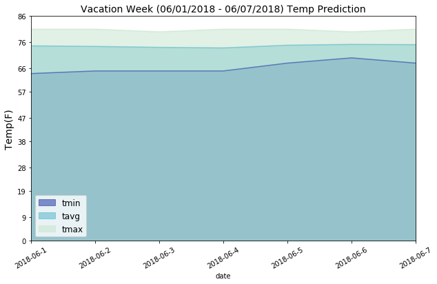

# Preprocessing the Data

# Step 1: Evaluating the Data


```python
import pandas as pd
import numpy as np
%matplotlib inline
```


```python
measurements_df = pd.read_csv('../resources/hawaii_measurements.csv')
stations_df = pd.read_csv('../resources/hawaii_stations.csv')
```

### Hawaii_Measurements

#### Sample dataframe


```python
measurements_df.head(20)
```


<div>
  <table border="1" class="dataframe">
    <thead>
      <tr style="text-align: right;">
        <th></th>
        <th>station</th>
        <th>date</th>
        <th>prcp</th>
        <th>tobs</th>
      </tr>
    </thead>
    <tbody>
      <tr>
        <th>0</th>
        <td>USC00519397</td>
        <td>2010-01-01</td>
        <td>0.08</td>
        <td>65</td>
      </tr>
      <tr>
        <th>1</th>
        <td>USC00519397</td>
        <td>2010-01-02</td>
        <td>0.00</td>
        <td>63</td>
      </tr>
      <tr>
        <th>2</th>
        <td>USC00519397</td>
        <td>2010-01-03</td>
        <td>0.00</td>
        <td>74</td>
      </tr>
      <tr>
        <th>3</th>
        <td>USC00519397</td>
        <td>2010-01-04</td>
        <td>0.00</td>
        <td>76</td>
      </tr>
      <tr>
        <th>4</th>
        <td>USC00519397</td>
        <td>2010-01-06</td>
        <td>NaN</td>
        <td>73</td>
      </tr>
      <tr>
        <th>5</th>
        <td>USC00519397</td>
        <td>2010-01-07</td>
        <td>0.06</td>
        <td>70</td>
      </tr>
      <tr>
        <th>6</th>
        <td>USC00519397</td>
        <td>2010-01-08</td>
        <td>0.00</td>
        <td>64</td>
      </tr>
      <tr>
        <th>7</th>
        <td>USC00519397</td>
        <td>2010-01-09</td>
        <td>0.00</td>
        <td>68</td>
      </tr>
      <tr>
        <th>8</th>
        <td>USC00519397</td>
        <td>2010-01-10</td>
        <td>0.00</td>
        <td>73</td>
      </tr>
      <tr>
        <th>9</th>
        <td>USC00519397</td>
        <td>2010-01-11</td>
        <td>0.01</td>
        <td>64</td>
      </tr>
      <tr>
        <th>10</th>
        <td>USC00519397</td>
        <td>2010-01-12</td>
        <td>0.00</td>
        <td>61</td>
      </tr>
      <tr>
        <th>11</th>
        <td>USC00519397</td>
        <td>2010-01-14</td>
        <td>0.00</td>
        <td>66</td>
      </tr>
      <tr>
        <th>12</th>
        <td>USC00519397</td>
        <td>2010-01-15</td>
        <td>0.00</td>
        <td>65</td>
      </tr>
      <tr>
        <th>13</th>
        <td>USC00519397</td>
        <td>2010-01-16</td>
        <td>0.00</td>
        <td>68</td>
      </tr>
      <tr>
        <th>14</th>
        <td>USC00519397</td>
        <td>2010-01-17</td>
        <td>0.00</td>
        <td>64</td>
      </tr>
      <tr>
        <th>15</th>
        <td>USC00519397</td>
        <td>2010-01-18</td>
        <td>0.00</td>
        <td>72</td>
      </tr>
      <tr>
        <th>16</th>
        <td>USC00519397</td>
        <td>2010-01-19</td>
        <td>0.00</td>
        <td>66</td>
      </tr>
      <tr>
        <th>17</th>
        <td>USC00519397</td>
        <td>2010-01-20</td>
        <td>0.00</td>
        <td>66</td>
      </tr>
      <tr>
        <th>18</th>
        <td>USC00519397</td>
        <td>2010-01-21</td>
        <td>0.00</td>
        <td>69</td>
      </tr>
      <tr>
        <th>19</th>
        <td>USC00519397</td>
        <td>2010-01-22</td>
        <td>0.00</td>
        <td>67</td>
      </tr>
    </tbody>
  </table>
</div>


#### Row counts


```python
measurements_df.count()
```


    station    19550
    date       19550
    prcp       18103
    tobs       19550
    dtype: int64


#### Number of prcp NaN values


```python
num_nans = measurements_df.station.count() - measurements_df.prcp.count()
num_nans
```


    1447


```python
f"Percentage of NaN values to Total Number of Rows: {(num_nans / len(measurements_df))*100 :.2f}%"
```


    'Percentage of NaN values to Total Number of Rows: 7.40%'


Because the amount of prcp NaN values is more than 5% of total prcp values I think imputing will be a better alternative to dropping those values and losing a lot of good data represented by the other variables.

#### Descriptive statistics


```python
measurements_df.describe()
```


<div>
  <table border="1" class="dataframe">
    <thead>
      <tr style="text-align: right;">
        <th></th>
        <th>prcp</th>
        <th>tobs</th>
      </tr>
    </thead>
    <tbody>
      <tr>
        <th>count</th>
        <td>18103.000000</td>
        <td>19550.000000</td>
      </tr>
      <tr>
        <th>mean</th>
        <td>0.160644</td>
        <td>73.097954</td>
      </tr>
      <tr>
        <th>std</th>
        <td>0.468746</td>
        <td>4.523527</td>
      </tr>
      <tr>
        <th>min</th>
        <td>0.000000</td>
        <td>53.000000</td>
      </tr>
      <tr>
        <th>25%</th>
        <td>0.000000</td>
        <td>70.000000</td>
      </tr>
      <tr>
        <th>50%</th>
        <td>0.010000</td>
        <td>73.000000</td>
      </tr>
      <tr>
        <th>75%</th>
        <td>0.110000</td>
        <td>76.000000</td>
      </tr>
      <tr>
        <th>max</th>
        <td>11.530000</td>
        <td>87.000000</td>
      </tr>
    </tbody>
  </table>
</div>


```python
measurements_df.hist(figsize=(10,4))
```


    array([[<matplotlib.axes._subplots.AxesSubplot object at 0x1075ffb00>,
            <matplotlib.axes._subplots.AxesSubplot object at 0x10f2d3dd8>]], dtype=object)


### Hawaii_Stations

#### Dataframe


```python
stations_df
```


<div>
  <table border="1" class="dataframe">
    <thead>
      <tr style="text-align: right;">
        <th></th>
        <th>station</th>
        <th>name</th>
        <th>latitude</th>
        <th>longitude</th>
        <th>elevation</th>
      </tr>
    </thead>
    <tbody>
      <tr>
        <th>0</th>
        <td>USC00519397</td>
        <td>WAIKIKI 717.2, HI US</td>
        <td>21.27160</td>
        <td>-157.81680</td>
        <td>3.0</td>
      </tr>
      <tr>
        <th>1</th>
        <td>USC00513117</td>
        <td>KANEOHE 838.1, HI US</td>
        <td>21.42340</td>
        <td>-157.80150</td>
        <td>14.6</td>
      </tr>
      <tr>
        <th>2</th>
        <td>USC00514830</td>
        <td>KUALOA RANCH HEADQUARTERS 886.9, HI US</td>
        <td>21.52130</td>
        <td>-157.83740</td>
        <td>7.0</td>
      </tr>
      <tr>
        <th>3</th>
        <td>USC00517948</td>
        <td>PEARL CITY, HI US</td>
        <td>21.39340</td>
        <td>-157.97510</td>
        <td>11.9</td>
      </tr>
      <tr>
        <th>4</th>
        <td>USC00518838</td>
        <td>UPPER WAHIAWA 874.3, HI US</td>
        <td>21.49920</td>
        <td>-158.01110</td>
        <td>306.6</td>
      </tr>
      <tr>
        <th>5</th>
        <td>USC00519523</td>
        <td>WAIMANALO EXPERIMENTAL FARM, HI US</td>
        <td>21.33556</td>
        <td>-157.71139</td>
        <td>19.5</td>
      </tr>
      <tr>
        <th>6</th>
        <td>USC00519281</td>
        <td>WAIHEE 837.5, HI US</td>
        <td>21.45167</td>
        <td>-157.84889</td>
        <td>32.9</td>
      </tr>
      <tr>
        <th>7</th>
        <td>USC00511918</td>
        <td>HONOLULU OBSERVATORY 702.2, HI US</td>
        <td>21.31520</td>
        <td>-157.99920</td>
        <td>0.9</td>
      </tr>
      <tr>
        <th>8</th>
        <td>USC00516128</td>
        <td>MANOA LYON ARBO 785.2, HI US</td>
        <td>21.33310</td>
        <td>-157.80250</td>
        <td>152.4</td>
      </tr>
    </tbody>
  </table>
</div>

</br>
</br>

# Step 2: Testing and Applying Null Value Replacement Methods

### Modify dataframes to perform ML on NaN values

#### Merge dataframes into one dataframe


```python
climate_df = measurements_df.merge(stations_df, how='inner', on='station')
climate_df.head()
```


<div>
  <table border="1" class="dataframe">
    <thead>
      <tr style="text-align: right;">
        <th></th>
        <th>station</th>
        <th>date</th>
        <th>prcp</th>
        <th>tobs</th>
        <th>name</th>
        <th>latitude</th>
        <th>longitude</th>
        <th>elevation</th>
      </tr>
    </thead>
    <tbody>
      <tr>
        <th>0</th>
        <td>USC00519397</td>
        <td>2010-01-01</td>
        <td>0.08</td>
        <td>65</td>
        <td>WAIKIKI 717.2, HI US</td>
        <td>21.2716</td>
        <td>-157.8168</td>
        <td>3.0</td>
      </tr>
      <tr>
        <th>1</th>
        <td>USC00519397</td>
        <td>2010-01-02</td>
        <td>0.00</td>
        <td>63</td>
        <td>WAIKIKI 717.2, HI US</td>
        <td>21.2716</td>
        <td>-157.8168</td>
        <td>3.0</td>
      </tr>
      <tr>
        <th>2</th>
        <td>USC00519397</td>
        <td>2010-01-03</td>
        <td>0.00</td>
        <td>74</td>
        <td>WAIKIKI 717.2, HI US</td>
        <td>21.2716</td>
        <td>-157.8168</td>
        <td>3.0</td>
      </tr>
      <tr>
        <th>3</th>
        <td>USC00519397</td>
        <td>2010-01-04</td>
        <td>0.00</td>
        <td>76</td>
        <td>WAIKIKI 717.2, HI US</td>
        <td>21.2716</td>
        <td>-157.8168</td>
        <td>3.0</td>
      </tr>
      <tr>
        <th>4</th>
        <td>USC00519397</td>
        <td>2010-01-06</td>
        <td>NaN</td>
        <td>73</td>
        <td>WAIKIKI 717.2, HI US</td>
        <td>21.2716</td>
        <td>-157.8168</td>
        <td>3.0</td>
      </tr>
    </tbody>
  </table>
</div>


#### Convert date-time to ordinal


```python
from datetime import datetime
```


```python
climate_df['ord_date'] = climate_df.date.apply(lambda x: datetime.strptime(x, '%Y-%m-%d').date().toordinal())
```

### ML


```python
from sklearn import model_selection
from sklearn.linear_model import LinearRegression
from sklearn.linear_model import LassoCV
```


```python
ml_df = climate_df[['ord_date','prcp', 'tobs', 'latitude', 'longitude', 'elevation']].dropna().copy()
```


```python
X = np.array(ml_df.drop(['prcp'], axis=1))
y = np.array(ml_df['prcp'])
```


```python
X_train, X_test, y_train, y_test = model_selection.train_test_split(X, y, test_size=.2)
```

##### Classifier: Linear Regression


```python
clf_LinRe = LinearRegression()
clf_LinRe.fit(X_train, y_train)
clf_LinRe.score(X_test, y_test)
```
LR R-squared value


    0.047373298296047299


##### Classifier: Lasso Cross Validation


```python
clf_Lasso = LassoCV()
clf_Lasso.fit(X_train, y_train)
clf_Lasso.score(X_test, y_test)
```
LCV R-squared value


    0.04508408449044532


Machine Learning was a fail as shown by the low R-squared values. I could not find a suitable algorithm that would predict percipitation based off of the features: date, temperature, latitude, longitude, elevation.

### Replacing percipation NaNs

#### Determining the type of statistical central tendancy value to impute


```python
measurements_df.groupby('station')['prcp'].hist(figsize=(10,4), bins=20)
```


    station
    USC00511918    AxesSubplot(0.125,0.125;0.775x0.755)
    USC00513117    AxesSubplot(0.125,0.125;0.775x0.755)
    USC00514830    AxesSubplot(0.125,0.125;0.775x0.755)
    USC00516128    AxesSubplot(0.125,0.125;0.775x0.755)
    USC00517948    AxesSubplot(0.125,0.125;0.775x0.755)
    USC00518838    AxesSubplot(0.125,0.125;0.775x0.755)
    USC00519281    AxesSubplot(0.125,0.125;0.775x0.755)
    USC00519397    AxesSubplot(0.125,0.125;0.775x0.755)
    USC00519523    AxesSubplot(0.125,0.125;0.775x0.755)
    Name: prcp, dtype: object


```python
measurements_df.groupby('station').median()
```


<div>
  <table border="1" class="dataframe">
    <thead>
      <tr style="text-align: right;">
        <th></th>
        <th>prcp</th>
        <th>tobs</th>
      </tr>
      <tr>
        <th>station</th>
        <th></th>
        <th></th>
      </tr>
    </thead>
    <tbody>
      <tr>
        <th>USC00511918</th>
        <td>0.00</td>
        <td>72</td>
      </tr>
      <tr>
        <th>USC00513117</th>
        <td>0.02</td>
        <td>73</td>
      </tr>
      <tr>
        <th>USC00514830</th>
        <td>0.02</td>
        <td>75</td>
      </tr>
      <tr>
        <th>USC00516128</th>
        <td>0.16</td>
        <td>71</td>
      </tr>
      <tr>
        <th>USC00517948</th>
        <td>0.00</td>
        <td>75</td>
      </tr>
      <tr>
        <th>USC00518838</th>
        <td>0.03</td>
        <td>73</td>
      </tr>
      <tr>
        <th>USC00519281</th>
        <td>0.04</td>
        <td>72</td>
      </tr>
      <tr>
        <th>USC00519397</th>
        <td>0.00</td>
        <td>76</td>
      </tr>
      <tr>
        <th>USC00519523</th>
        <td>0.00</td>
        <td>75</td>
      </tr>
    </tbody>
  </table>
</div>


Because the distribution of percipation values are skewed to the right I am going to impute median values into their NaNs based on which station that value is representing.

#### Imputing specific station median values into NaNs


```python
stations = stations_df.groupby('station').count().reset_index().station.tolist()
meds = measurements_df.groupby('station').prcp.median().tolist()
```


```python
for row, column in measurements_df[['station', 'prcp']].loc[measurements_df.prcp.isnull() == True].iterrows():
    for n in np.arange(0, len(stations)):
        if column.station == stations[n]:
            measurements_df.at[row, 'prcp'] = meds[n]
```


```python
measurements_df.count()
```


    station    19550
    date       19550
    prcp       19550
    tobs       19550
    dtype: int64


```python
measurements_df.groupby('station')['prcp'].hist(figsize=(10,4), bins=20)
```


    station
    USC00511918    AxesSubplot(0.125,0.125;0.775x0.755)
    USC00513117    AxesSubplot(0.125,0.125;0.775x0.755)
    USC00514830    AxesSubplot(0.125,0.125;0.775x0.755)
    USC00516128    AxesSubplot(0.125,0.125;0.775x0.755)
    USC00517948    AxesSubplot(0.125,0.125;0.775x0.755)
    USC00518838    AxesSubplot(0.125,0.125;0.775x0.755)
    USC00519281    AxesSubplot(0.125,0.125;0.775x0.755)
    USC00519397    AxesSubplot(0.125,0.125;0.775x0.755)
    USC00519523    AxesSubplot(0.125,0.125;0.775x0.755)
    Name: prcp, dtype: object


The distribution didn't alter much after imputing values. It looks good to me, lets export it.

</br>
</br>

# Step 3: Export Clean Data


```python
measurements_df.to_csv('../resources/clean_hawaii_measurements.csv', index=False)
```
</br>
</br>
<hr>

# Migrating CSV Data into a Relational Database

# Step 1: Import CSV Data into Pandas Dataframes


```python
import pandas as pd
```

#### Clean_Hawaii_Measurments


```python
measurments_df = pd.read_csv('../resources/clean_hawaii_measurements.csv')
```


```python
measurments_df.head()
```


<div>
  <table border="1" class="dataframe">
    <thead>
      <tr style="text-align: right;">
        <th></th>
        <th>station</th>
        <th>date</th>
        <th>prcp</th>
        <th>tobs</th>
      </tr>
    </thead>
    <tbody>
      <tr>
        <th>0</th>
        <td>USC00519397</td>
        <td>2010-01-01</td>
        <td>0.08</td>
        <td>65</td>
      </tr>
      <tr>
        <th>1</th>
        <td>USC00519397</td>
        <td>2010-01-02</td>
        <td>0.00</td>
        <td>63</td>
      </tr>
      <tr>
        <th>2</th>
        <td>USC00519397</td>
        <td>2010-01-03</td>
        <td>0.00</td>
        <td>74</td>
      </tr>
      <tr>
        <th>3</th>
        <td>USC00519397</td>
        <td>2010-01-04</td>
        <td>0.00</td>
        <td>76</td>
      </tr>
      <tr>
        <th>4</th>
        <td>USC00519397</td>
        <td>2010-01-06</td>
        <td>0.00</td>
        <td>73</td>
      </tr>
    </tbody>
  </table>
</div>


```python
measurments_df.count()
```


    station    19550
    date       19550
    prcp       19550
    tobs       19550
    dtype: int64


```python
measurments_df.dtypes
```


    station     object
    date        object
    prcp       float64
    tobs         int64
    dtype: object


#### Hawaii_Stations


```python
stations_df = pd.read_csv('../resources/hawaii_stations.csv')
```


```python
stations_df.head()
```


<div>
  <table border="1" class="dataframe">
    <thead>
      <tr style="text-align: right;">
        <th></th>
        <th>station</th>
        <th>name</th>
        <th>latitude</th>
        <th>longitude</th>
        <th>elevation</th>
      </tr>
    </thead>
    <tbody>
      <tr>
        <th>0</th>
        <td>USC00519397</td>
        <td>WAIKIKI 717.2, HI US</td>
        <td>21.2716</td>
        <td>-157.8168</td>
        <td>3.0</td>
      </tr>
      <tr>
        <th>1</th>
        <td>USC00513117</td>
        <td>KANEOHE 838.1, HI US</td>
        <td>21.4234</td>
        <td>-157.8015</td>
        <td>14.6</td>
      </tr>
      <tr>
        <th>2</th>
        <td>USC00514830</td>
        <td>KUALOA RANCH HEADQUARTERS 886.9, HI US</td>
        <td>21.5213</td>
        <td>-157.8374</td>
        <td>7.0</td>
      </tr>
      <tr>
        <th>3</th>
        <td>USC00517948</td>
        <td>PEARL CITY, HI US</td>
        <td>21.3934</td>
        <td>-157.9751</td>
        <td>11.9</td>
      </tr>
      <tr>
        <th>4</th>
        <td>USC00518838</td>
        <td>UPPER WAHIAWA 874.3, HI US</td>
        <td>21.4992</td>
        <td>-158.0111</td>
        <td>306.6</td>
      </tr>
    </tbody>
  </table>
</div>


```python
stations_df.count()
```


    station      9
    name         9
    latitude     9
    longitude    9
    elevation    9
    dtype: int64


```python
stations_df.dtypes
```


    station       object
    name          object
    latitude     float64
    longitude    float64
    elevation    float64
    dtype: object

</br>
</br>

# Step 2: Mapping Data and Connecting the Schema


```python
import sqlalchemy
from sqlalchemy import create_engine, MetaData
from sqlalchemy.ext.declarative import declarative_base
from sqlalchemy import Column, String, Integer, Float, Text
```


```python
engine = create_engine('sqlite:///../resources/database/hawaii.sqlite')
```


```python
Base = declarative_base(bind=engine)
```


```python
class Measurement(Base):
    __tablename__ = 'measurement'
    id = Column(Integer, primary_key=True)
    station = Column(String(15))
    date = Column(Text)
    prcp = Column(Float(6,2))
    tobs = Column(Integer)


class Station(Base):
    __tablename__ = 'station'
    id = Column(Integer, primary_key=True)
    station = Column(String(15))
    name = Column(String(75))
    latitude = Column(Float(6,4))
    longitude = Column(Float(6,4))
    elevation = Column(Float(6,2))
```


```python
Base.metadata.create_all()
```
</br>
</br>

# Step 3: Migrating Dataframe into Schema


```python
data_measurements = measurments_df.to_dict(orient='records')
data_stations = stations_df.to_dict(orient='records')
```


```python
metadata = MetaData(bind=engine)
metadata.reflect()
```


```python
table_measurement = sqlalchemy.Table('measurement', metadata, autoload=True)
table_station = sqlalchemy.Table('station', metadata, autoload=True)
```


```python
engine.execute(table_measurement.delete())
engine.execute(table_station.delete())
```


    <sqlalchemy.engine.result.ResultProxy at 0x106b68ac8>


```python
engine.execute(table_measurement.insert(), data_measurements)
engine.execute(table_station.insert(), data_stations)
```


    <sqlalchemy.engine.result.ResultProxy at 0x10779c160>


### Testing the tables that store the migrated data


```python
engine.execute("SELECT * FROM measurement LIMIT 5").fetchall()
```


    [(1, 'USC00519397', '2010-01-01', 0.08, 65),
     (2, 'USC00519397', '2010-01-02', 0.0, 63),
     (3, 'USC00519397', '2010-01-03', 0.0, 74),
     (4, 'USC00519397', '2010-01-04', 0.0, 76),
     (5, 'USC00519397', '2010-01-06', 0.0, 73)]


```python
engine.execute("SELECT * FROM station LIMIT 5").fetchall()
```


    [(1, 'USC00519397', 'WAIKIKI 717.2, HI US', 21.2716, -157.8168, 3.0),
     (2, 'USC00513117', 'KANEOHE 838.1, HI US', 21.4234, -157.8015, 14.6),
     (3, 'USC00514830', 'KUALOA RANCH HEADQUARTERS 886.9, HI US', 21.5213, -157.8374, 7.0),
     (4, 'USC00517948', 'PEARL CITY, HI US', 21.3934, -157.9751, 11.9),
     (5, 'USC00518838', 'UPPER WAHIAWA 874.3, HI US', 21.4992, -158.0111, 306.6)]
</br>
</br>
<hr>

# Analysis Prep: Reading Data from Relational Database


```python
from sqlalchemy import create_engine, inspect, func
from sqlalchemy.orm import Session
from sqlalchemy.ext.automap import automap_base

import matplotlib.pyplot as plt
```

#### Connect the sqlite database file to the variable `engine`
```python
engine = create_engine('sqlite:///../resources/database/hawaii.sqlite')
```

#### Prep for inspection
```python
inspector_gadget = inspect(engine)
```


```python
inspector_gadget.get_table_names()
```


    ['measurement', 'station']


#### Review the measuremnt table's contents
```python
print("tablename: measurement \n")
for piece in inspector_gadget.get_columns(table_name='measurement'):
    print(piece['name'], piece['type'])
```

    tablename: measurement

    id INTEGER
    station VARCHAR(15)
    date TEXT
    prcp FLOAT
    tobs INTEGER


#### Review the station table's contents
```python
print("tablename: station \n")
for piece in inspector_gadget.get_columns(table_name='station'):
    print(piece['name'], piece['type'])
```

    tablename: station

    id INTEGER
    station VARCHAR(15)
    name VARCHAR(75)
    latitude FLOAT
    longitude FLOAT
    elevation FLOAT


```python
Base = automap_base()
```


```python
Base.prepare(engine=engine, reflect=True)
```

#### Map the database tables to the Base class
```python
Measurement = Base.classes.measurement
Station = Base.classes.station
```

#### Begine a session with sqlalchemy's orm to allow for SQL queries of the tables
```python
session = Session(bind=engine)
```

</br>
</br>

# Precipitation Analysis


```python
import pandas as pd
import numpy as np
```


```python
last_12_mo = session.query(Measurement.date, Measurement.prcp).filter(Measurement.date >= '2016-08-01', Measurement.date <= '2017-08-31').all()
```


```python
prec_df = pd.DataFrame(last_12_mo)
prec_df.date = pd.to_datetime(prec_df.date, format='%Y-%m-%d').dt.date
prec_df.set_index('date', inplace=True)
```


```python
prec_df.rename(columns={'prcp':'precipitation'}, inplace=True)
```


```python
prec_df.head()
```


<div>
  <table border="1" class="dataframe">
    <thead>
      <tr style="text-align: right;">
        <th></th>
        <th>precipitation</th>
      </tr>
      <tr>
        <th>date</th>
        <th></th>
      </tr>
    </thead>
    <tbody>
      <tr>
        <th>2016-08-01</th>
        <td>0.08</td>
      </tr>
      <tr>
        <th>2016-08-02</th>
        <td>0.05</td>
      </tr>
      <tr>
        <th>2016-08-03</th>
        <td>0.00</td>
      </tr>
      <tr>
        <th>2016-08-04</th>
        <td>0.04</td>
      </tr>
      <tr>
        <th>2016-08-05</th>
        <td>0.01</td>
      </tr>
    </tbody>
  </table>
</div>

</br>
<hr>

## HELP! - This is the last section that needs work before the project is complete

#### bar plot using the dataframe with one index, in date date-type %Y-%m-%d,  and one column of values


```python
print(f"Max Precipitation: {prec_df.precipitation.max()}, Min Precipitation: {prec_df.precipitation.min()}")
```

    Max Precipitation: 6.7, Min Precipitation: 0.0


```python
len(prec_df)
```


    2372


```python
prec_df[:40].plot.bar(figsize=(15,4), rot=30, color='teal')
plt.legend(loc=2)
plt.show()
```


```python
# import datetime
```


```python
# base = datetime.datetime(2016, 8, 1)
# arr = np.array([base + datetime.timedelta(months=i) for i in xrange(12)])
# arr
```


```python
# dates = np.array(['2016-08-01','2016-09-01','2016-10-01','2016-11-01','2016-12-01','2017-01-01','2017-02-01','2017-03-01',
#          '2017-04-01','2017-05-01','2017-06-01','2017-07-01','2017-08-01'], dtype='datetime64')
```

#### same bar plot, removing all the text in the xaxis


```python
# df.plot.bar(yticks=np.arange(0,5), ylim=((0,4)))
# ax1 = plt.axes()
# x_axis = ax1.axes.get_xaxis()
# x_axis.set_visible(False)

# plt.show()

```

#### plt monthly


```python
# import datetime
# from dateutil.rrule import rrule, MONTHLY
```


```python
# d1 = datetime.date(2016,8,1)
# d2 = datetime.date(2017,8,31)

# dates = [dt.strftime('%Y-%m-%d') for dt in rrule(MONTHLY, dtstart=d1, until=d2)]
# dates
```


```python
# plt.close('all')
```
## end of struggle section
<hr>
</br>

# Station Analysis


```python
station_count = session.query(Station).count()
print(f"The number of weather stations on Honolulu Hawaii are {station_count}.")
```

    The number of weather stations on Honolulu Hawaii are 9.


```python
station_observation_count = session.query(Measurement.station, func.count(Measurement.station)).group_by(Measurement.station).order_by(-func.count(Measurement.station)).all()
for station, count in station_observation_count:
    print(f"Station: {station}, Number of Observations: {count}")

print("\n" + "-"*55 + "\n")
print(f"The weather station with the highest amount of observations is {station_observation_count[0][0]} with {station_observation_count[0][1]} observations.")
```

    Station: USC00519281, Number of Observations: 2772
    Station: USC00519397, Number of Observations: 2724
    Station: USC00513117, Number of Observations: 2709
    Station: USC00519523, Number of Observations: 2669
    Station: USC00516128, Number of Observations: 2612
    Station: USC00514830, Number of Observations: 2202
    Station: USC00511918, Number of Observations: 1979
    Station: USC00517948, Number of Observations: 1372
    Station: USC00518838, Number of Observations: 511

    -------------------------------------------------------

    The weather station with the highest amount of observations is USC00519281 with 2772 observations.


#### Last 12 months of temperature observation data


```python
last_12_mo = session.query(Measurement.station, Measurement.tobs, Measurement.date).filter(Measurement.date >= '2016-08-01', Measurement.date <= '2017-08-31').all()
```


```python
largest_count = pd.DataFrame(last_12_mo)[['station','tobs']].groupby('station').count().sort_values('tobs', ascending=False)[:1].index.item()
```


```python
largest_station = session.query(Measurement.tobs, Measurement.date).filter(Measurement.date >= '2016-08-01', Measurement.date <= '2017-08-31', Measurement.station == largest_count).all()
```


```python
df = pd.DataFrame(largest_station)
```


```python
df.plot.hist(bins=12, zorder=2, title=largest_count, grid=True, figsize=(10,6), fontsize=12, color='teal')
plt.ylabel('Frequency', size=14)
plt.legend(loc=1, prop={'size': 14})
plt.show()
```


</br>
</br>

# Temperature Analysis


```python
def calc_temps(start_date, end_date):
    results = session.query(Measurement.tobs).filter(Measurement.date >= start_date, Measurement.date <= end_date).all()
    results_ra = np.ravel(results)

    minimum = np.min(results_ra)
    average = np.average(results_ra)
    maximum = np.max(results_ra)
    return minimum, average, maximum
```


```python
last_year_min, last_year_avg, last_year_max = calc_temps('2017-01-01', '2018-01-01')
```


```python
last_year_min
```


    58


```python
last_year_max
```


    87


```python
fig, ax = plt.subplots(figsize=(2,6))
ax.bar(1, last_year_avg, yerr=[(last_year_min-last_year_avg, last_year_max-last_year_avg)], color='teal')
x_axis = ax.axes.get_xaxis()
x_axis.set_visible(False)
ax.set_title('Trip Avg Temp')
ax.set_ylabel('Temp(F)')
plt.grid()
plt.show()
```


</br>
</br>

# Vacation Rain and Temperature Analysis


```python
# Calcualte the rainfall per weather station using the previous year's matching dates.
rainfall_ly = session.query(Measurement.station, func.sum(Measurement.prcp)).filter(Measurement.date >= '2016-08-01', Measurement.date <= '2017-08-31').group_by(Measurement.station).all()

print("Total Rainfall Last Year")
for station, rainfall in rainfall_ly:
    print(f"Station: {station}, Total Rainfall: {rainfall}.")
```

    Total Rainfall Last Year
    Station: USC00513117, Total Rainfall: 54.39000000000004.
    Station: USC00514830, Total Rainfall: 35.379999999999995.
    Station: USC00516128, Total Rainfall: 165.75999999999996.
    Station: USC00517948, Total Rainfall: 4.77.
    Station: USC00519281, Total Rainfall: 80.06000000000006.
    Station: USC00519397, Total Rainfall: 17.23999999999999.
    Station: USC00519523, Total Rainfall: 40.14.


```python
def daily_norms(date):
    diced = date.split("-")
    if int(diced[1]) < 10 and len(diced[1]) < 2:
        date2 = f"0{diced[1]}"
        date = f"{diced[0]}-{date2}"

    results = session.query(Measurement.tobs).filter(Measurement.date.like(f"%{date}")).all()
    results_ra = np.ravel(results)

    minimum = np.min(results_ra)
    average = np.average(results_ra)
    maximum = np.max(results_ra)
    return minimum, average, maximum
```


```python
travel_dates = [f"2018-06-{i+1}" for i in range(7)]
```


```python
norms = []
for date in travel_dates:
    minimum, average, maximum = daily_norms(date[5:])
    norms.append((date, minimum, average, maximum))
```


```python
vacation_df = pd.DataFrame(norms, columns=['date','tmin','tavg','tmax']).set_index('date')
```


```python
pal = ["#1127a0", "#48b1c9", "#c5e5cc"]

vacation_df.plot(kind='area', color=pal, stacked=False, yticks=np.linspace(0,vacation_df.tmax.max()+5,10, dtype=int), rot=30, figsize=(10,6))
plt.title('Vacation Week Temp Prediction', size=14)
plt.ylabel('Temp(F)', size=14)
plt.legend(loc=3, prop={'size': 12})
plt.show()
```





```python
plt.close('all')
```

<hr>
<hr>

# Viewing the Flask API App
## How to execute the flask python app contained in the flask directory
Dependencies: Install the modules using these commands
```bash
pip install pandas
pip install numpy
pip install sqlalchemy
pip install flask
```

Then navigate to the location in your system where the flask app is contained `flask/app.py` and execute the script using the  following command:
```bash
python app.py
```
from there open up a browser and type `localhost:5000` into the url bar and the page should populate. Enjoy!

